# uc-agent 아키텍처

## 시스템 개요

uc-agent는 Claude Agent SDK 기반의 멀티 에이전트 시스템으로, UseCase 주도 설계의 8단계 워크플로우를 자동화한다. 오케스트레이터가 사용자 요청을 분석하여 워커 에이전트를 선택하고 시퀀싱하며, 각 워커는 SKILL.md를 시스템 프롬프트로 사용하여 파일 기반 산출물을 생성한다.

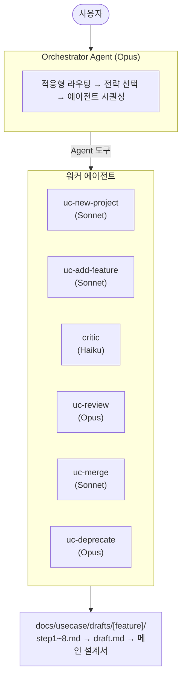

---

## 디렉토리 구조

```
uc-agent/
├── pyproject.toml                         # 엔트리포인트: uc-agent, uc-agent-mcp
├── README.md
├── ARCHITECTURE.md                        # 이 문서
├── src/uc_agent/
│   ├── __init__.py
│   ├── __main__.py                        # python -m uc_agent 지원
│   │
│   │  ── 진입점 ──
│   ├── main.py                            # CLI (argparse → 3개 모드 분기)
│   ├── mcp_server.py                      # MCP 서버 (도구 4개 노출)
│   │
│   │  ── 코어 ──
│   ├── orchestrator.py                    # 멀티 에이전트 파이프라인
│   ├── agents.py                          # 워커 에이전트 구성 + 모델 선택
│   ├── parallel.py                        # 병렬 리뷰 (anyio)
│   │
│   │  ── 전략 ──
│   ├── routing.py                         # 적응형 라우팅 (규모 판단 → 전략)
│   ├── feedback.py                        # 피드백 루프 (리뷰 패턴 → 프롬프트 주입)
│   ├── checkpoint.py                      # 체크포인트/재개
│   │
│   │  ── 검증 ──
│   ├── validation.py                      # 구조 검증 (regex) + 시맨틱 검증 (LLM)
│   ├── tracing.py                         # 옵저버빌리티 (비용/시간 추적)
│   │
│   └── prompts/
│       ├── orchestrator_automated.md      # 자동 모드 오케스트레이터 프롬프트
│       ├── orchestrator_interactive.md    # 인터랙티브 모드 프롬프트
│       ├── critic.md                      # 즉각 CRITICAL 검사 프롬프트
│       └── validator.md                   # 시맨틱 검증 프롬프트
│
└── tests/

usecase-driven-design/skills/             # 워커 에이전트의 시스템 프롬프트
├── uc-new-project/SKILL.md               # 새 프로젝트 8단계 설계
├── uc-add-feature/SKILL.md               # 기존 프로젝트 기능 추가
├── uc-review/SKILL.md                    # 5관점 리뷰
├── uc-merge/SKILL.md                     # 메인 문서 병합
├── uc-deprecate/SKILL.md                 # UC 폐기/제거
└── usecase-driven-design/SKILL.md        # 경량 일괄 설계 (단계별 확인 없음)
```

---

## 모듈 의존성 그래프

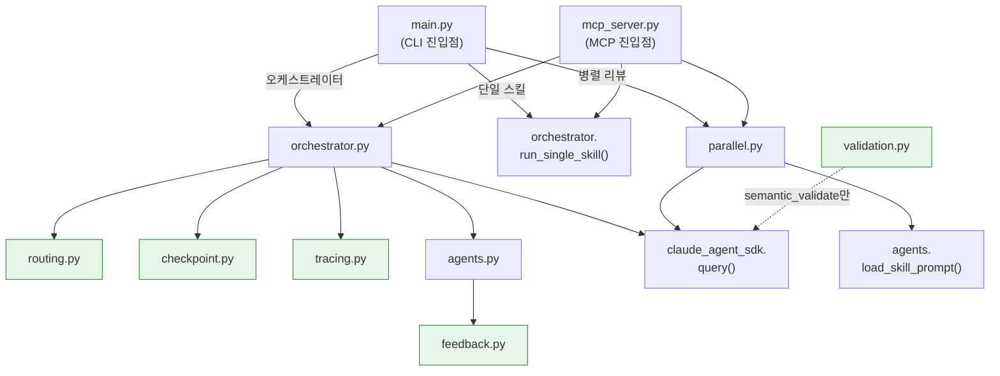

> 초록 배경 모듈은 서로 의존하지 않는 독립 모듈이다. 모두 `orchestrator.py`에서 조합된다.

핵심 원칙: `routing`, `checkpoint`, `feedback`, `tracing`, `validation`은 서로 의존하지 않는 독립 모듈이다. 모두 `orchestrator.py`에서 조합된다.

---

## 실행 모드

### CLI 엔트리포인트 (`main.py`)

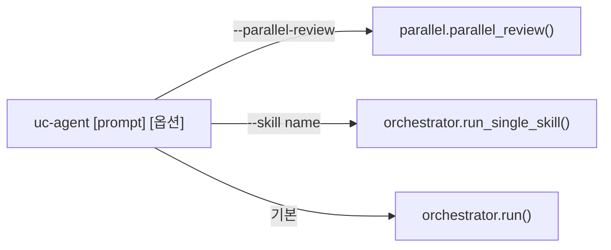

| 옵션 | 기본값 | 설명 |
|------|--------|------|
| `--mode` | `interactive` | `automated` \| `interactive` |
| `--cost-tier` | `standard` | `economy` \| `standard` \| `premium` |
| `--resume` | — | 중단된 워크플로우 재개 (drafts 디렉토리) |
| `--skill` | — | 단일 스킬 직접 실행 |
| `--model` | — | 오케스트레이터 모델 |
| `--worker-model` | — | 워커 에이전트 모델 (일괄) |
| `--parallel-review` | — | 병렬 리뷰할 draft 경로 목록 |
| `--cwd` | `.` | 프로젝트 루트 디렉토리 |
| `--skills-dir` | 자동 감지 | SKILL.md 디렉토리 |
| `--max-turns` | `200` | 최대 에이전틱 턴 수 |

### MCP 엔트리포인트 (`mcp_server.py`)

`uc-agent-mcp` 명령으로 MCP 서버를 실행한다. Claude Code 등 MCP 클라이언트에서 아래 도구를 호출할 수 있다.

| 도구 | 내부 호출 |
|------|----------|
| `design_project(project_name, requirements, mode)` | `orchestrator.run()` |
| `review_draft(draft_path)` | `orchestrator.run_single_skill("uc-review")` |
| `merge_draft(draft_path)` | `orchestrator.run_single_skill("uc-merge")` |
| `review_drafts_parallel(draft_paths)` | `parallel.parallel_review()` |

SDK MCP(`claude_agent_sdk.create_sdk_mcp_server`)를 우선 사용하되, 없으면 `mcp` 패키지로 폴백한다.

---

## 코어: 오케스트레이터 파이프라인

### `orchestrator.run()` 전체 흐름

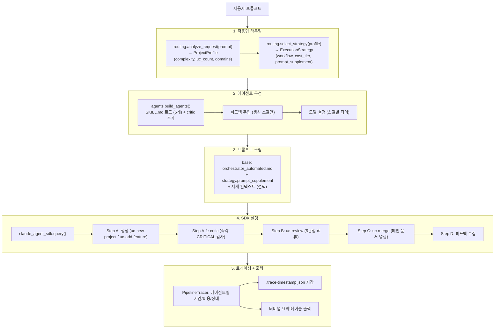

### 자동 모드 파이프라인 시퀀스

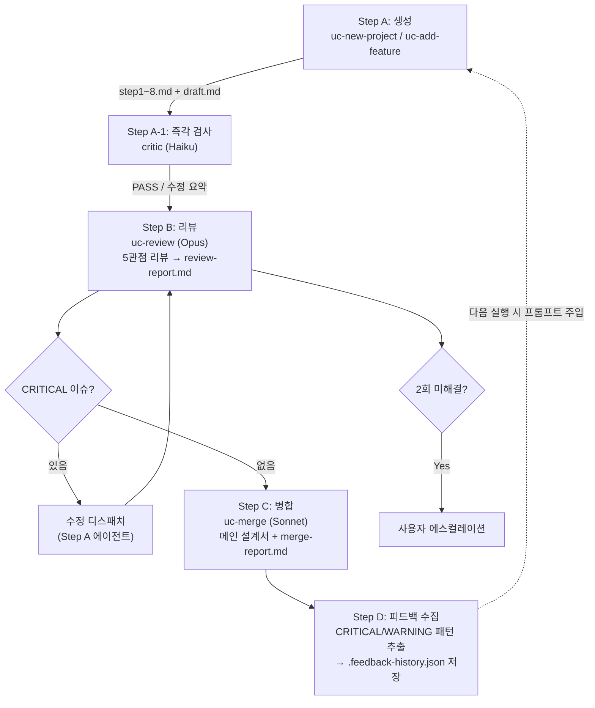

---

## 에이전트 구성 상세

### 에이전트 목록

| 에이전트 | 프롬프트 소스 | 기본 모델 | 역할 | 도구 |
|---------|-------------|----------|------|------|
| **오케스트레이터** | `prompts/orchestrator_*.md` | Opus | 요청 분석, 에이전트 선택/시퀀싱 | Read, Glob, Grep, Agent, Bash |
| **uc-new-project** | `skills/uc-new-project/SKILL.md` | Sonnet | 새 프로젝트 8단계 설계 | Read, Write, Edit, Glob, Grep, Bash |
| **uc-add-feature** | `skills/uc-add-feature/SKILL.md` | Sonnet | 기존 프로젝트 기능 추가 | 〃 |
| **uc-review** | `skills/uc-review/SKILL.md` | Opus | 5관점 리뷰 | 〃 |
| **uc-merge** | `skills/uc-merge/SKILL.md` | Sonnet | 메인 문서 병합 | 〃 |
| **uc-deprecate** | `skills/uc-deprecate/SKILL.md` | Opus | UC 폐기/제거 + 영향 분석 | 〃 |
| **critic** | `prompts/critic.md` | Haiku | 생성 직후 CRITICAL 즉각 검사 | 〃 |

### 모델 선택 로직 (`agents._resolve_worker_model`)

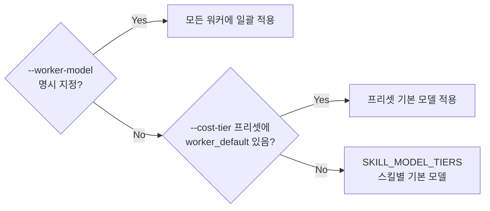

### 비용 티어 프리셋

| 티어 | 오케스트레이터 | 생성(new/add) | 리뷰/분석 | critic |
|------|-------------|-------------|----------|--------|
| **economy** | Sonnet | Haiku | Haiku | Haiku |
| **standard** | Opus | Sonnet | Opus | Haiku |
| **premium** | Opus | Opus | Opus | Haiku |

### SKILL.md 로드 (`agents.load_skill_prompt`)

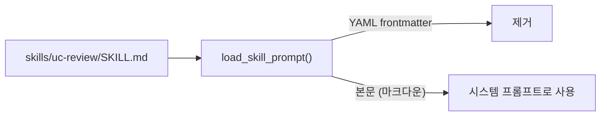

### 피드백 주입 (생성 스킬 전용)

`uc-new-project`와 `uc-add-feature`의 시스템 프롬프트 끝에 과거 리뷰 패턴이 추가된다:

```markdown
## 과거 피드백 기반 주의사항

과거 리뷰에서 반복 지적된 사항입니다. 이 사항들을 특히 주의하여 작성하세요:

1. [CRITICAL] 시나리오 step에 주어가 누락됨 (3회 반복)
2. [WARNING] UC ID에 gap이 존재함 (2회 반복)
...
```

---

## 적응형 라우팅 (`routing.py`)

사용자 요청 텍스트에서 프로젝트 규모를 추정하고 실행 전략을 결정한다.

### 규모 판단

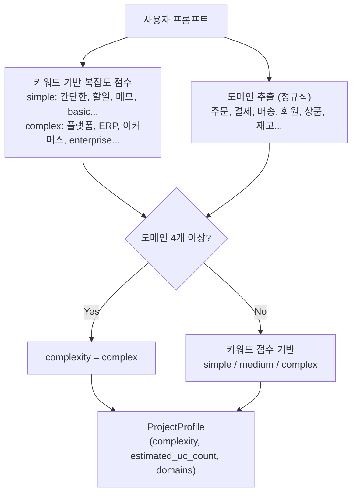

### 전략 선택

| 규모 | 워크플로우 | 비용 티어 | 자동 병합 | 프롬프트 보충 |
|------|----------|----------|----------|-------------|
| **simple** | 간소화 (UC 3개 이하, 다이어그램 최소) | economy | O | "프로젝트 규모: 소규모" |
| **medium** | 표준 8단계 | standard | O | (없음) |
| **complex** | 도메인 분할 → 병렬 생성 | premium | X (수동) | "프로젝트 규모: 대규모" + 도메인 목록 |

---

## 체크포인트/재개 (`checkpoint.py`)

### 저장 형식

```json
// docs/usecase/drafts/[feature]/.checkpoint.json
{
  "project_name": "order-system",
  "feature_name": "order",
  "mode": "automated",
  "current_step": 5,
  "completed_steps": [1, 2, 3, 4],
  "drafts_dir": "docs/usecase/drafts/order",
  "original_prompt": "주문 관리 시스템 설계",
  "created_at": "2026-04-07T10:00:00+00:00",
  "updated_at": "2026-04-07T10:15:00+00:00"
}
```

### 재개 흐름

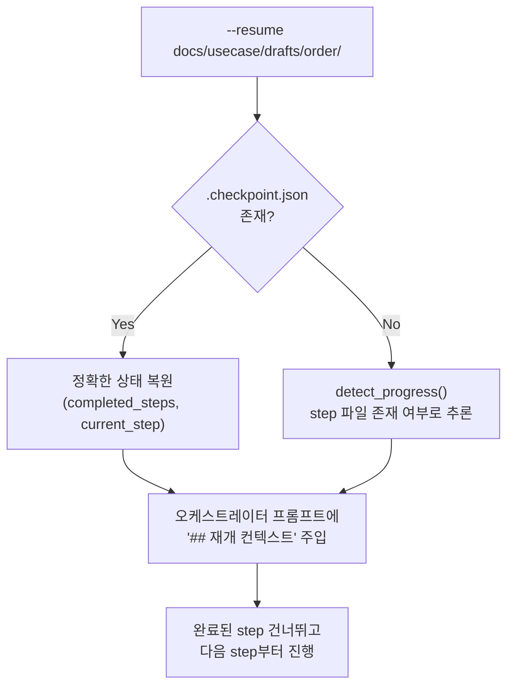

---

## 피드백 루프 (`feedback.py`)

리뷰에서 반복 지적되는 패턴을 수집하여, 다음 설계 생성에 반영한다.

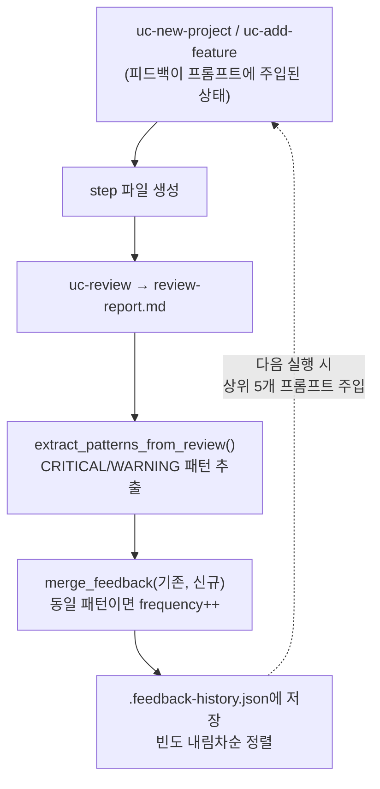

---

## 검증 (`validation.py`)

### 구조 검증 (regex 기반)

step별 필수 패턴이 파일에 존재하는지 확인한다:

| Step | 필수 패턴 |
|------|----------|
| 1 (유스케이스) | `UC-\d+` |
| 2 (시나리오) | `기본\s*흐름` \| `Basic\s*Flow` |
| 3 (변수) | `독립변수` \| `Independent` |
| 4 (도메인 모델) | `엔티티` \| `Entity` |
| 5 (상태 모델) | `상태` \| `State` \| `stateDiagram` |
| 6 (시스템 경계) | `액터` \| `시스템\s*경계` |
| 7 (예외) | `예외` \| `Exception` |
| 8 (조건) | `사전조건` \| `사후조건` |

### 시맨틱 검증 (LLM 기반)

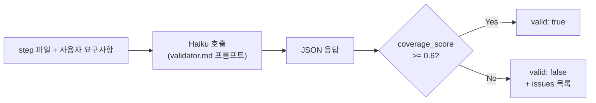

---

## 옵저버빌리티 (`tracing.py`)

### 추적 구조

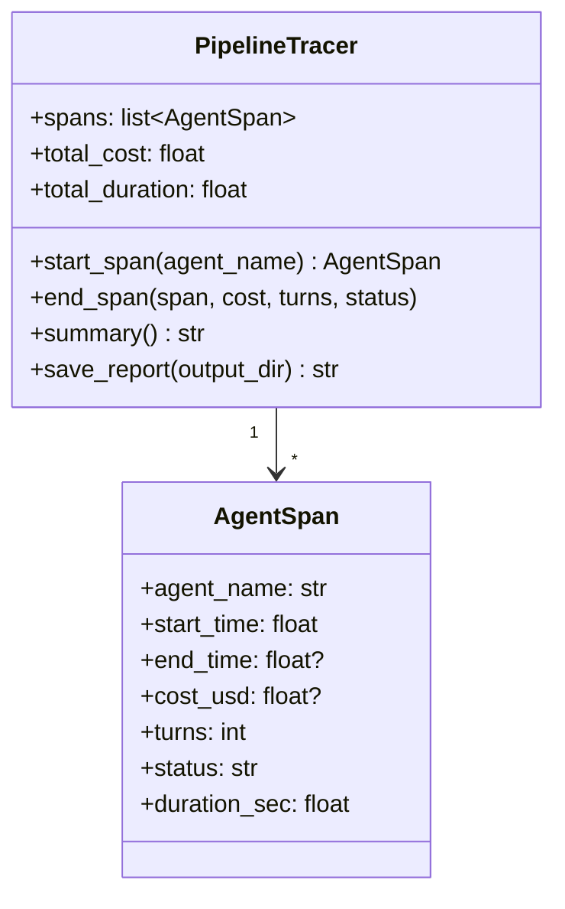

### 출력 예시

```
=== 파이프라인 실행 요약 ===
에이전트                 시간       비용    상태
------------------------------------------------
orchestrator           245.3s    $0.8920     OK
uc-new-project          89.2s    $0.2340     OK
critic                   5.1s    $0.0012     OK
uc-review               62.7s    $0.3150     OK
uc-merge                31.4s    $0.0890     OK
------------------------------------------------
총합                   245.3s    $1.5312
```

### 트레이스 파일

`.trace-{YYYYMMDD-HHMMSS}.json`으로 프로젝트 디렉토리에 저장된다.

---

## 병렬 리뷰 (`parallel.py`)

anyio의 구조화된 동시성(task group)으로 여러 draft를 동시에 리뷰한다.

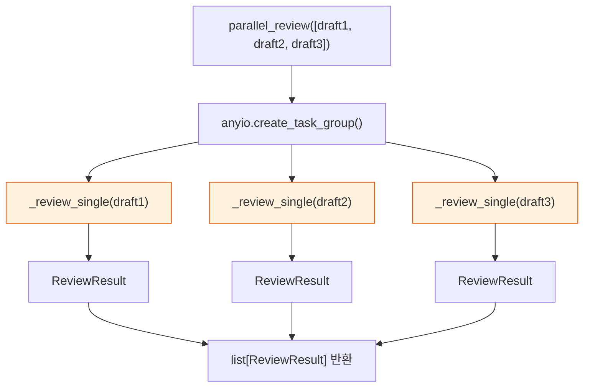

각 `_review_single`은 독립적으로 `uc-review` 프롬프트를 로드하고 `claude_agent_sdk.query()`를 호출한다.

---

## 산출물 구조

```
docs/usecase/
├── [project]-usecase-design.md         ← 메인 통합 설계서
├── merge-report-[날짜].md              ← 병합 리포트
├── .feedback-history.json              ← 피드백 히스토리
├── .trace-[timestamp].json             ← 실행 트레이스
├── drafts/
│   └── [feature]/
│       ├── .checkpoint.json            ← 체크포인트
│       ├── step1-usecases.md           ← 1단계: 유스케이스 목록
│       ├── step2-scenarios.md          ← 2단계: 시나리오
│       ├── step3-variables.md          ← 3단계: 변수 식별
│       ├── step4-domain-model.md       ← 4단계: 도메인 모델
│       ├── step5-state-model.md        ← 5단계: 상태 모델
│       ├── step6-system-boundary.md    ← 6단계: 시스템 경계
│       ├── step7-exceptions.md         ← 7단계: 예외 정리
│       ├── step8-conditions.md         ← 8단계: 사전/사후조건
│       ├── review-report.md            ← 리뷰 리포트
│       └── [feature]-draft.md          ← 통합 초안
└── deprecated/                          ← 폐기된 UC 백업
```

---

## 에스컬레이션 정책

자동 모드에서 사용자에게 제어가 넘어가는 경우:

| 상황 | 동작 |
|------|------|
| step 파일 검증 2회 실패 | 해당 step 확인 요청 |
| 리뷰 CRITICAL 수정 후에도 미해결 | 이슈 목록 제시 |
| 도메인 모델 충돌 | 병합 전략 결정 요청 |
| 대규모 프로젝트 병합 | 도메인 간 의존성 확인 |

인터랙티브 모드에서는 매 step마다 사용자 확인을 받는다.
